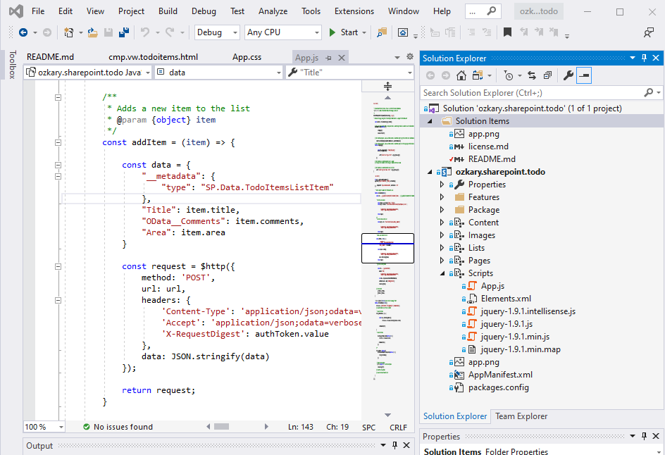

# SharePoint Add-in with Office 365 and Angular

Use this project to get an intro at building an Angular component with SharePoint data list as backend. The integration
is done using SharePoint Rest APIs

## Demo Angular App


### Getting the Security Token

```javascript
    /**
    * gets the security token
    **/
    const token = () => {
                      
        const url = "../_api/contextinfo";

        $http({
            method: 'POST',
            url: url,
            headers: {
                'Content-Type': 'application/json;odata=verbose',
                'Accept': 'application/json;odata=verbose'
            }
        }).then(function success(resp) {
            var data = resp.data.d.GetContextWebInformation;                
            authToken = {};
            authToken.name = 'X-RequestDigest';
            authToken.value = data['FormDigestValue'];
                
        }, function error(resp) {
            console.log(resp);
        });            
            
    }
```

## Getting Started

### Make sure to install the Office Development tools with Visual Studio.
https://visualstudio.microsoft.com/vs/features/office-tools/
<p>
</a>
<p>
</a>


### Project Packages to import into Microsoft 365 tenant

- ProductLog_Powerbi.pbix   PowerBI Solution
- ProductLog_Chatbot.zip    Power Virtual Agent Sample
- ProductLog_PowerApps.zip  PowerApp Sample
<p>
After importing the projects make sure to update the connection to match your SharePoint tenant url and data list.
<p>
<iframe src="https://onedrive.live.com/embed?cid=3DDB1F0F5F8E9724&resid=3DDB1F0F5F8E9724%213272&authkey=AKh8qz3MqhFMl5o&em=2" width="780" height="550" frameborder="0" scrolling="no"></iframe>

### Create a free account on Office 365
https://developer.microsoft.com/en-us/office/dev-program
<p>

### SharePoint service Reference
https://docs.microsoft.com/en-us/sharepoint/dev/sp-add-ins/get-to-know-the-sharepoint-rest-service
<p>
</img>
<p>

#### Working with Lists (CRUD API Calls)

https://docs.microsoft.com/en-us/sharepoint/dev/sp-add-ins/working-with-lists-and-list-items-with-rest

``` javascript
     /**
    * Adds a new item to the list
    * @param {object} item
    */
    const addItem = (item) => {

        const data = {
            "__metadata": {
                "type": "SP.Data.TodoItemsListItem"
            },
            "Title": item.title,
            "OData__Comments": item.comments,
            "Area": item.area
        }

        const request = $http({
            method: 'POST',
            url: url,
            headers: {
                'Content-Type': 'application/json;odata=verbose',
                'Accept': 'application/json;odata=verbose',
                'X-RequestDigest': authToken.value
            },
            data: JSON.stringify(data)
        });

        return request;
    } 

```

### Microsoft Graph API
https://developer.microsoft.com/en-us/graph
<p>
</img>
<p>
</img>

### Create a developer site collection on Office 365
https://www.ozkary.com/2018/08/upload-sharepoint-sandbox-solution-to.html
<p>

## Licensing

Copyright (c) 2011-2017 GitHub Inc.

Permission is hereby granted, free of charge, to any person obtaining a copy of this software and associated documentation files (the "Software"), to deal in the Software without restriction, including without limitation the rights to use, copy, modify, merge, publish, distribute, sublicense, and/or sell copies of the Software, and to permit persons to whom the Software is furnished to do so, subject to the following conditions:

The above copyright notice and this permission notice shall be included in all copies or substantial portions of the Software.

THE SOFTWARE IS PROVIDED "AS IS", WITHOUT WARRANTY OF ANY KIND, EXPRESS OR IMPLIED, INCLUDING BUT NOT LIMITED TO THE WARRANTIES OF MERCHANTABILITY, FITNESS FOR A PARTICULAR PURPOSE AND NONINFRINGEMENT. IN NO EVENT SHALL THE AUTHORS OR COPYRIGHT HOLDERS BE LIABLE FOR ANY CLAIM, DAMAGES OR OTHER LIABILITY, WHETHER IN AN ACTION OF CONTRACT, TORT OR OTHERWISE, ARISING FROM, OUT OF OR IN CONNECTION WITH THE SOFTWARE OR THE USE OR OTHER DEALINGS IN THE SOFTWARE.

##  Stats

<a href="https://github.com/ozkary/sp-addin-todo/issues"></a><br/>
<a href="https://github.com/ozkary/sp-addin-todo/network"></a><br/>
<a href="https://github.com/ozkary/sp-addin-todo/stargazers"></a><br/>
<a href="https://github.com/ozkary/sp-addin-todo"></a><br/>
<a href="https://twitter.com/intent/tweet?text=Wow:&url=https%3A%2F%2Fgithub.com%2Fozkary%2Fsp-addin-todo"></a><br/>